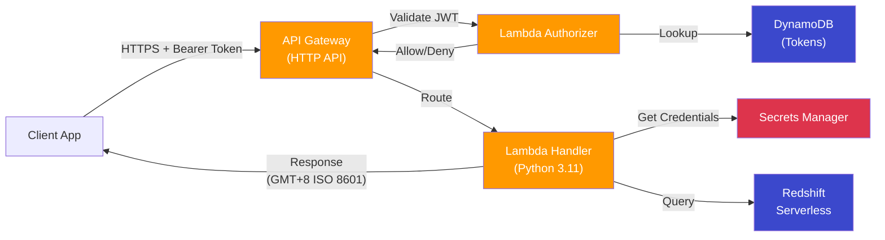
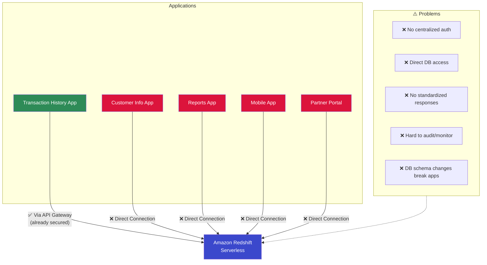
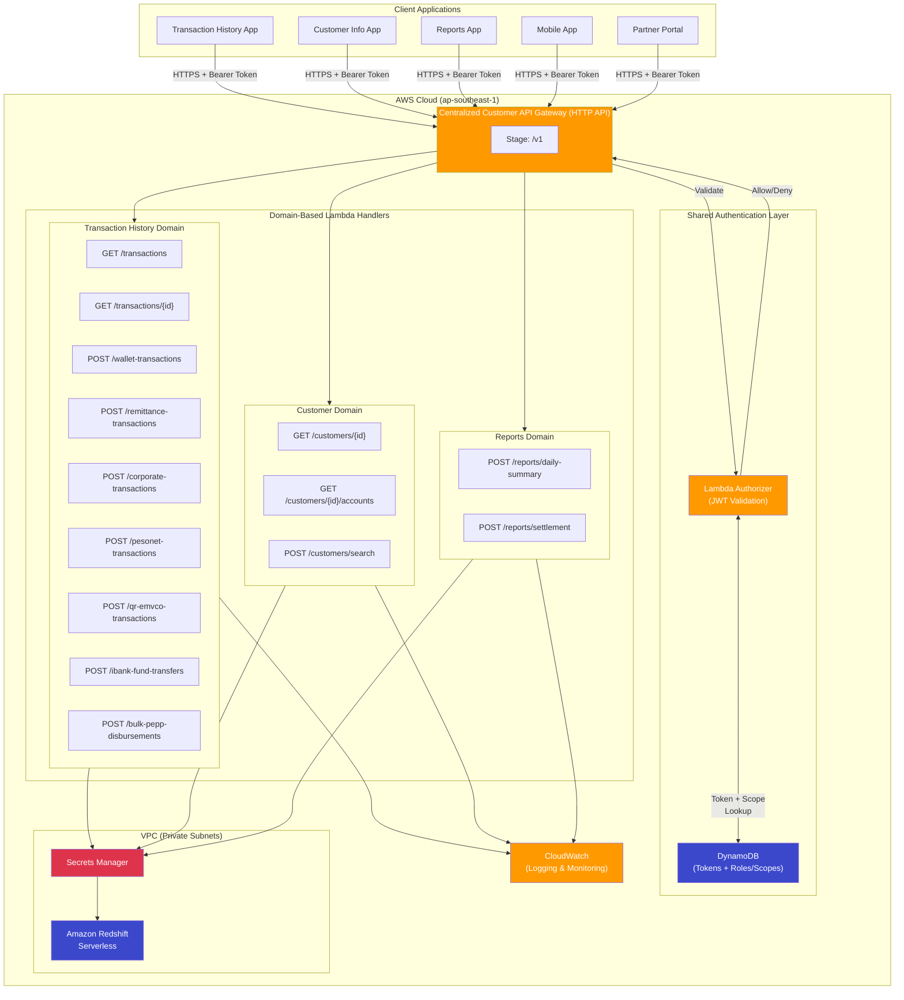
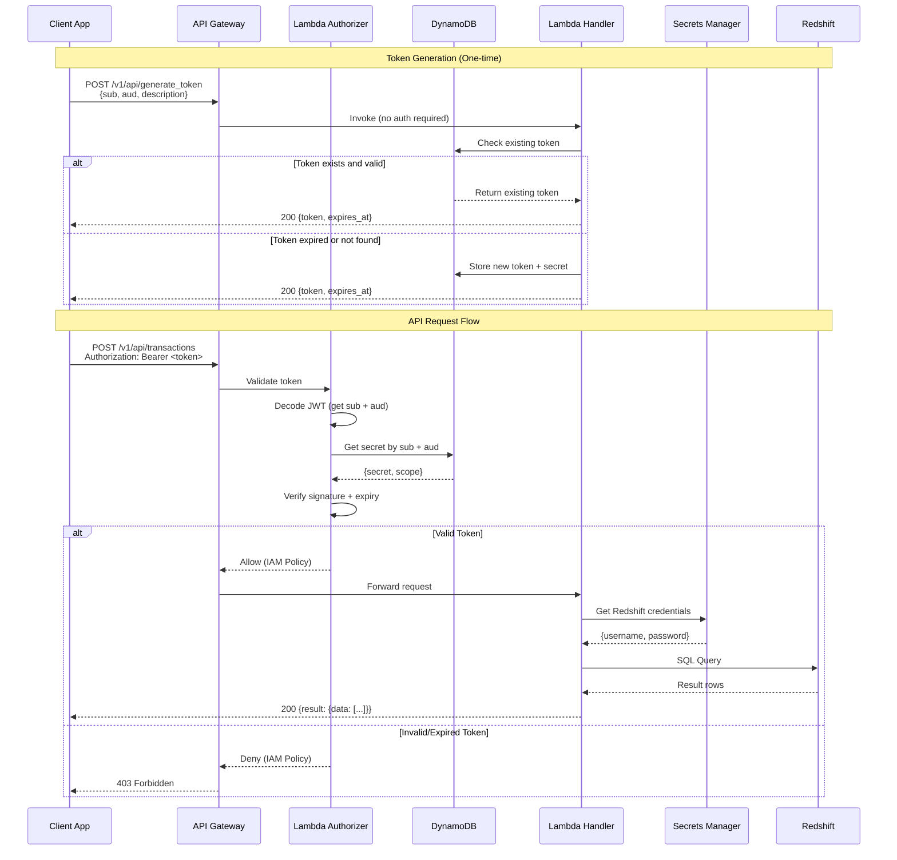
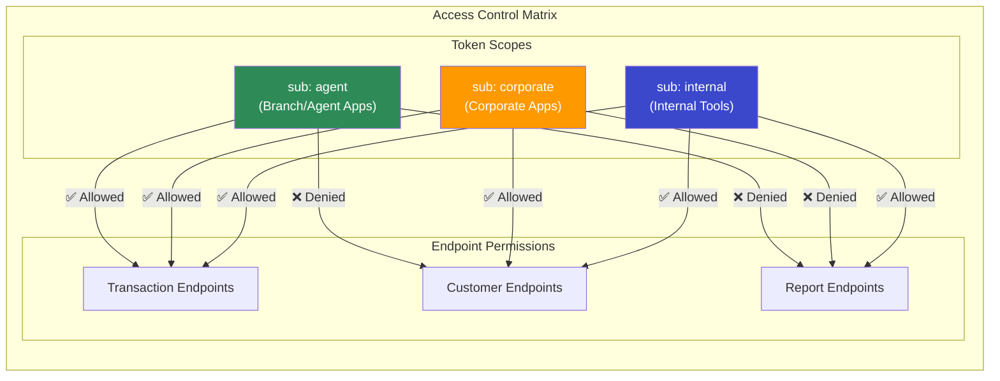

# Architecture Diagrams

## 1. Current Architecture — Transaction History API

```mermaid
flowchart TB
    subgraph Clients["Client Applications"]
        APP1["Transaction History\nConsumer App"]
    end

    subgraph AWS["AWS Cloud (ap-southeast-1)"]
        subgraph APIGW["Amazon API Gateway v2 (HTTP API)"]
            ROUTE1["POST /v1/api/generate_token"]
            ROUTE2["POST /v1/api/transactions"]
            ROUTE3["GET /v1/api/transactions/{retRefNo}"]
            ROUTE4["POST /v1/api/wallet-transaction-history"]
            ROUTE5["POST /v1/api/remittance-transaction-history"]
            ROUTE6["POST /v1/api/qr-emvco-transaction-history"]
            ROUTE7["POST /v1/api/ibank-fund-transfer-history"]
            ROUTE8["POST /v1/api/corporate-transaction-history"]
            ROUTE9["POST /v1/api/pesonet-transaction-history"]
            ROUTE10["POST /v1/api/bulk-pepp-disbursement-history"]
        end

        subgraph AUTH["Authentication Layer"]
            AUTHORIZER["Lambda Authorizer\n(cauth_token)"]
            DDB["DynamoDB\n(cauth_tokens)"]
        end

        subgraph VPC["VPC (Private Subnets)"]
            subgraph LAMBDA["Lambda Functions (Python 3.11)"]
                GEN_TOKEN["generate_cauth_token"]
                TXN["transaction_history_logs"]
                TXN_VIEW["transaction_view"]
                WALLET["wallet_transaction"]
                REMIT["remittance_transaction"]
                QR["qr_emvco_transaction"]
                IBANK["ibank_ft_transaction"]
                CORP["corporate_transaction"]
                PESO["pesonet_transaction"]
                BULK["bulk_pepp_disbursement"]
            end

            subgraph DATA["Data Layer"]
                SM["Secrets Manager\n(Redshift Credentials)"]
                RS["Amazon Redshift\nServerless"]
            end

            VPCE_SM["VPC Endpoint\n(Secrets Manager)"]
            VPCE_RS["VPC Endpoint\n(Redshift Data)"]
        end

        CW["CloudWatch Logs"]
        LAYER["Lambda Layer\n(psycopg2, pydantic, PyJWT)"]
    end

    APP1 -->|"HTTPS Request"| APIGW
    APIGW -->|"Authorization\nCheck"| AUTHORIZER
    AUTHORIZER -->|"Lookup Token"| DDB
    AUTHORIZER -->|"Allow/Deny"| APIGW

    ROUTE1 --> GEN_TOKEN
    GEN_TOKEN -->|"Store Token"| DDB

    ROUTE2 --> TXN
    ROUTE3 --> TXN_VIEW
    ROUTE4 --> WALLET
    ROUTE5 --> REMIT
    ROUTE6 --> QR
    ROUTE7 --> IBANK
    ROUTE8 --> CORP
    ROUTE9 --> PESO
    ROUTE10 --> BULK

    TXN --> VPCE_SM --> SM
    TXN --> VPCE_RS --> RS
    WALLET --> VPCE_SM
    WALLET --> VPCE_RS
    REMIT --> VPCE_SM
    REMIT --> VPCE_RS

    LAMBDA --> CW
    LAMBDA -.->|"Shared Dependencies"| LAYER
```

---

## 2. Current Architecture — Simplified View (for Presentation)

---

## 3. Problem Statement — Current State (Multiple Apps Direct Access)

---

## 4. Proposed Architecture — Centralized Customer API

---

## 5. Proposed — Detailed Request Flow

---

## 6. Proposed — Security & Access Control

---

## 7. Migration Path

```mermaid
flowchart LR
    subgraph PHASE1["Phase 1 ✅ (Done)"]
        direction TB
        P1A["Transaction History API"]
        P1B["JWT Auth (cauth)"]
        P1C["API Gateway + Lambda"]
    end

    subgraph PHASE2["Phase 2 (Current)"]
        direction TB
        P2A["Centralize API Gateway"]
        P2B["Add Role-Based Access"]
        P2C["Onboard Other Apps"]
    end

    subgraph PHASE3["Phase 3 (Future)"]
        direction TB
        P3A["Rate Limiting"]
        P3B["API Versioning"]
        P3C["Remove Direct DB Access"]
    end

    PHASE1 -->|"Blueprint"| PHASE2 -->|"Scale"| PHASE3

    style PHASE1 fill:#2E8B57,color:#fff
    style PHASE2 fill:#FF9900,color:#fff
    style PHASE3 fill:#3B48CC,color:#fff
```

---

## How to View These Diagrams

1. **VS Code** — Install "Markdown Preview Mermaid Support" extension, then preview this file
2. **GitHub** — Push this file; GitHub natively renders Mermaid diagrams
3. **Mermaid Live Editor** — Copy any diagram block to https://mermaid.live
4. **Export to PNG/SVG** — Use Mermaid Live Editor to export for slides

